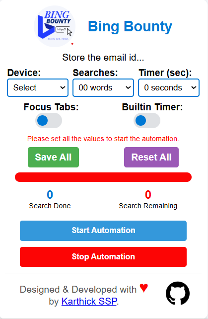

# BingBounty

  

**BingBounty** is a Microsoft Edge extension designed to automate Bing searches, helping users maximize their rewards effortlessly within daily and periodic limits. Set it up, sit back, and watch your points increase automatically!

---

## Table of Contents

- [Features](#features)
- [Installation](#installation)
- [Usage](#usage)
- [Screenshots](#screenshots)

---

## Features

- **Automated Bing Searches**: Conduct up to 30 Bing searches per day automatically to earn Edge rewards.
- **Customizable Rate Limits**: Enforces a 3 searches per 15-minute limit to comply with Bing's reward requirements (Cooldown Period).
- **Unique Daily Searches**: Uses a unique search term each day to ensure compliance with Bing’s terms.
- **User-friendly Interface**: Easily start and stop automation with a simple, intuitive popup interface.
- **Secure & Private**: No data is collected from the user; BingBounty only interacts with the Bing search engine to perform searches.

---

## Installation

1. **Clone the Repository**  
   Clone the repository to your local machine using:

   ```bash
   git clone https://github.com/karthickssp/BingBounty.git
   cd BingBounty
2. **Load the Extension in Microsoft Edge**  
   - Open Microsoft Edge and navigate to `edge://extensions/`.
   - Enable **Developer mode** in the bottom left corner.
   - Click **Load unpacked** and select the `BingBounty` folder.

3. **Setup**  
   The extension is now installed and ready to be configured from the popup UI.

---

## Usage

1. **Start Automation**  
   - Open the extension popup and select the type of automation you want:
     - **Custom Timer**: Specify the number of searches and the timer in seconds.
     - **Pre-Defined Timer**: Runs with a fixed limit of 3 searches every 15 minutes.
     - **No Timer**: Opens tabs and performs searches all at once.

2. **Stop/Close Automation**  
   - Use the **Stop Automation** button to stop the searches.
   - Use the **Close Automation** button to close all automated tabs.

3. **Monitor Search Progress**  
   - The console in Developer Tools (`Ctrl + Shift + I`) will display real-time progress for ongoing searches.

---

## Configuration

- **Focus Tabs**: Toggle to enable/disable focus on tabs when performing searches.
- **Search Count**: Select the total number of searches for the day (up to 30).
- **Timer**: Set a custom timer (in seconds) for interval-based searches.

### Default Automation Settings

- `maxSearchesPerCycle`: 3 searches per cycle (fixed)
- `restPeriod`: 15 minutes (900,000 milliseconds) between cycles
- **Daily Cap**: 30 searches

---

## Screenshots

  
  
   
