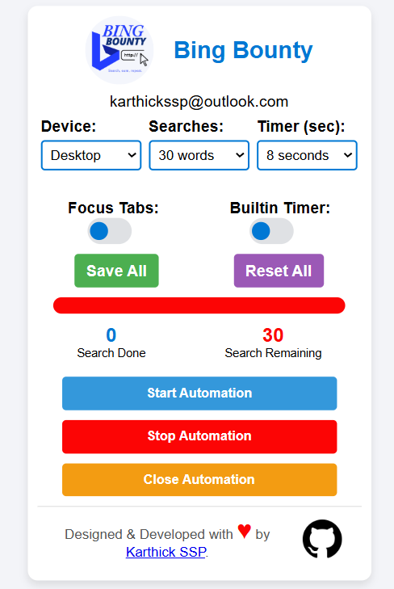
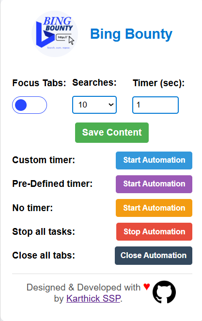

# **BingBounty**

<div align="center">
  
</div>

**BingBounty** is a browser extension designed to automate Bing searches and help users earn Microsoft Edge points efficiently. The extension supports customizable search timers and predefined automation workflows, providing flexibility and ease of use.

---

## Table of Contents

- [Features](#features)
- [Versions](#versions)
- [Installation](#installation)
- [Usage](#usage)
- [Screenshots](#screenshots)

---

## Features

- **Automated Bing Searches**: Conduct up to 30 Bing searches per day automatically to earn Edge rewards.
- **Customizable Rate Limits**: Enforces a 3 searches per 15-minute limit to comply with Bing's reward requirements (Cooldown Period).
- **Unique Daily Searches**: Uses a unique search term each day to ensure compliance with Bing’s terms.
- **User-friendly Interface**: Easily start and stop automation with a simple, intuitive popup interface.
- **Secure & Private**: No data is collected from the user; BingBounty only interacts with the Bing search engine to perform searches.
- Automates up to **30 searches per day** with customizable timers.
- Supports both **mobile and desktop** search topics with seamless device switching.
- Includes safety features such as **pause/resume, stop, and cycle limits**.

---


## Versions

### **Version 1: Basic Automation**
- **Features**:
  - Automates up to 30 searches daily.
  - Allows users to choose between custom timers and predefined timers.
  - Ensures no more than 3 searches are performed every 15 minutes.
  - Randomized search delays between **15–30 seconds** for predefined timers.
- **Limitations**:
  - Single-tab search execution.
  - No advanced feedback on automation progress.

---

### **Version 2: Advanced Automation**
- **Improvements**:
  - **Device-Based Search Topics**:
    - Automatically switches between **mobile** and **desktop** topics based on the device.
    - Topics are updated daily, using a unique query generator with 930 topics.
  - **Enhanced Timer Options**:
    - Customizable timer ranges for precise control over search intervals.
    - Intelligent scheduling of cycles with resting periods.
  - **Dynamic State Management**:
    - Supports pausing, resuming, and stopping automation seamlessly.
    - Provides logs for active automation types and progress tracking.
  - **Improved Multi-Cycle Execution**:
    - Handles overlapping cycles to avoid duplicate execution.
    - Dynamically adjusts timers to respect daily limits.
  
  **Note: Mobile version is working only in Edge canary Browser**

---

## Installation

1. **Clone the Repository**
   Clone the repository to your local machine using:

   ```bash
   git clone https://github.com/karthickssp/BingBounty.git
   cd BingBounty
   ```

2. **Load the Extension in Microsoft Edge**

   - Open Microsoft Edge and navigate to `edge://extensions/`.
   - Enable **Developer mode** in the bottom left corner.
   - Click **Load unpacked** and select the `BingBounty` folder.

3. **Setup**
   The extension is now installed and ready to be configured from the popup UI.

---

## Usage

1. **Start Automation**

   - Open the extension popup and select the type of automation you want:
     - **Custom Timer**: Specify the number of searches and the timer in seconds.
     - **Built-in Timer**: Runs with a fixed limit of 3 searches every 15 minutes.

2. **Stop/Close Automation**

   - Use the **Stop Automation** button to stop the searches.

3. **Monitor Search Progress**

   - The console in Developer Tools (`Ctrl + Shift + I`) will display real-time progress for ongoing searches.

---

## Configuration

- **Focus Tabs**: Toggle to enable/disable focus on tabs when performing searches.
- **Search Count**: Select the total number of searches for the day (up to 30).
- **Timer**: Set a custom timer (in seconds) for interval-based searches.

### Default Automation Settings

- `maxSearchesPerCycle`: 3 searches per cycle (fixed)
- `restPeriod`: 15 minutes (900,000 milliseconds) between cycles
- **Daily Cap**: 30 searches

---

## Screenshots

<div align="center">
  
</div>
<br/><hr/>
<div align="center">
  
</div>
<br/><hr/>
<div align="center">
  
</div>
